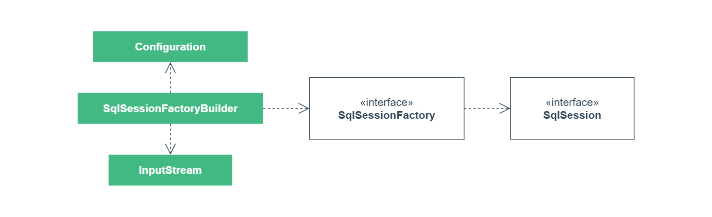

[TOC]

MyBatis 是一款优秀的持久层框架，有自定义 SQL、高级映射等功能，支持 XML 方式或注解方式来配置映射。

## 一、概述

MyBatis 应用都以一个 `SqlSessionFactory` 实例为核心，它可以构建 `SqlSession` 实例，`SqlSession` 提供了数据库操作的所有方法，也可以直接执行已映射的 SQL 语句。



`SqlSessionFactoryBuilder` 通过 `Configuration` 配置类来构建 `SqlSessionFactory`。

配置类可以是来自 XML 格式的任意输入流，也可以直接使用 Java 类。

## 二、SqlSessionFactory

### 1. 构建

**基于 XML 文件构建**

创建一个 `mybatis-config.xml` 文件来定义配置。

```xml
<configuration>
    <settings>
        <setting name="mapUnderscoreToCamelCase" value="true"/>
    </settings>
    <environments default="dev">
        <environment id="dev">
            <transactionManager type="MANAGED"/>
            <dataSource type="POOLED">
                <property name="driver" value="DATABASE_DRIVER"/>
                <property name="url" value="DATABASE_URL"/>
                <property name="username" value=""/>
                <property name="password" value=""/>
            </dataSource>
        </environment>
    </environments>
    <mappers>
        <mapper resource="mapper/UserMapper.xml"/>
    </mappers>
</configuration>
```

基于 XML 配置创建 `SqlSessionFactory` 实例。

```java
InputStream inputStream = Resources.getResourceAsStream("mybatis-config.xml");
SqlSessionFactory sqlSessionFactory = new SqlSessionFactoryBuilder().build(inputStream);
```

**基于 Java 类构建**

直接使用 Java 类定义配置，配置中添加一个 `UserMapper` 映射。

```java
DataSource dataSource = new PooledDataSource(DATABASE_DRIVER, DATABASE_URL, "", "");
Environment env = new Environment("dev", new ManagedTransactionFactory(), dataSource);

Configuration configuration = new Configuration();
configuration.setMapUnderscoreToCamelCase(true);
configuration.setEnvironment(env);
configuration.addMapper(UserMapper.class);
SqlSessionFactory sqlSessionFactory = new SqlSessionFactoryBuilder().build(configuration);
```

因为基于 Java 类不使用 XML 配置，所以需要基于注解创建映射。

如果仍需基于 XML 创建映射，可以在 Mapper 接口相同路径下创建一个同名 XML 映射文件。

> 例如在 `UserMapper.class` 接口相同路径下创建 `UserMapper.xml` 文件

### 2. 映射

创建一个数据库操作的 Mapper 接口。

```java
public interface UserMapper {

    User selectById(Long id);
}
```

**基于 XML 创建映射**

新建 `UserMapper.xml` 文件，`namespace` 指定 Mapper 接口，指定接口方法 SQL 映射。

```xml
<mapper namespace="cn.codeartist.mybatis.mapper.UserMapper">
    <select id="selectById" resultType="cn.codeartist.mybatis.entity.User">
        SELECT * FROM t_user WHERE id = #{id}
    </select>
</mapper>
```

**基于注解创建映射**

直接在 Mapper 接口方法上使用 `@Select` 注解指定 SQL。

```java
public interface UserMapper {

    @Select("SELECT * FROM t_user WHERE id = #{id}")
    User selectById(Long id);
}
```

### 3. 运行

使用构建的 `SqlSessionFactory` 获取 `SqlSession` 实例，使用 `SqlSession` 获取 Mapper 映射接口。

```java
try (SqlSession sqlSession = sqlSessionFactory.openSession()) {
    UserMapper userMapper = sqlSession.getMapper(UserMapper.class);
    User user = userMapper.selectById(1L);
    System.out.println(user);
}
```

## 三、Configuration

### 1. 属性设置

MyBatis 配置文件中，可以使用 `<properties>` 来指定属性，也可以读取外部 Java 属性文件。

配置好的属性在整个配置文件中可以使用 `${}` 占位符来指定。

```properties
# config.properties
url=jdbc:h2:mem:default;MODE=MySQL;INIT=RUNSCRIPT FROM 'classpath:sql/init.sql'
```

属性使用示例如下：

```xml
<!-- 导入config.properties属性文件和指定driver属性 -->
<properties resource="config.properties">
    <property name="driver" value="org.h2.Driver"/>
</properties>

<!-- 在数据源配置中使用属性 -->
<dataSource type="POOLED">
    <property name="driver" value="${driver}"/>
    <property name="url" value="${url}"/>
    <property name="username" value=""/>
    <property name="password" value=""/>
</dataSource>
```

MyBatis 配置文件中，可以使用 `<settings>` 来指定重要的设置。

```xml
<!-- 设置 -->
<settings>
    <!-- 是否开启下划线-驼峰命名自动映射 -->
    <setting name="mapUnderscoreToCamelCase" value="true"/>
</settings>
```

> 更多配置项参考：<https://mybatis.org/mybatis-3/zh/configuration.html>

### 2. 数据源

MyBatis 支持不同环境指定不同的数据源配置，例如：本地、测试、生产等，但在实际应用中，一般会使用外部的环境隔离配置，比如使用 Spring 的 Profile 区分环境配置，所以不细讲。

同样的，MyBatis 的事务管理一般由外部容器提供，比如使用 Spring 的事务管理器，所以这里只需指定 `MANAGED` 即可。

```xml
<environments default="dev">
    <environment id="dev">
        <transactionManager type="MANAGED"/>
        <dataSource type="POOLED">
            <property name="driver" value="${driver}"/>
            <property name="url" value="${url}"/>
            <property name="username" value=""/>
            <property name="password" value=""/>
        </dataSource>
    </environment>
</environments>
```

数据源配置中，重点是数据源类型，一般使用 `POOLED` 线程池类型，也可以使用三方的数据库连接池，比如阿里的 `DruidDataSource`。

### 3. 类型别名

类型别名为 Java 实体类型设置一个缩写。仅用于 XML 配置，例如：

```xml
<typeAliases>
    <typeAlias alias="Blog" type="domain.blog.Blog"/>
</typeAliases>
```

当这样配置时，`Blog` 可以用在任何使用 `domain.blog.Blog` 的地方。

也可以指定一个包名，MyBatis 会在包下搜索需要的 Java 实体类，比如：

```xml
<typeAliases>
    <package name="domain.blog"/>
</typeAliases>
```

在包中的 Java 实体类，默认使用首字母小写的类名作为别名，比如 `domain.blog.Author` 的别名为 `author`，也可使用 `@Alias` 注解指定别名。

```java
@Alias("author")
public class Author {
    // ...
}
```

### 4. 映射器

MyBatis 配置文件中，使用 `<mappers>` 来指定映射文件，配置方式如下：

```xml
<!-- 指定Mapper映射文件 -->
<mappers>
    <mapper resource="org/mybatis/builder/AuthorMapper.xml"/>
    <mapper resource="org/mybatis/builder/BlogMapper.xml"/>
    <mapper resource="org/mybatis/builder/PostMapper.xml"/>
</mappers>

<!-- 指定Mapper接口 -->
<mappers>
    <mapper class="org.mybatis.builder.AuthorMapper"/>
    <mapper class="org.mybatis.builder.BlogMapper"/>
    <mapper class="org.mybatis.builder.PostMapper"/>
</mappers>

<!-- 指定包名，包内的全部Mapper接口都注册 -->
<mappers>
    <package name="org.mybatis.builder"/>
</mappers>
```

## 四、附录

### 1. 示例代码

Gitee 仓库：

<https://gitee.com/code_artist/mybatis>

### 2. 参考文献

MyBatis 3 官方文档：

<https://mybatis.org/mybatis-3/zh/>

