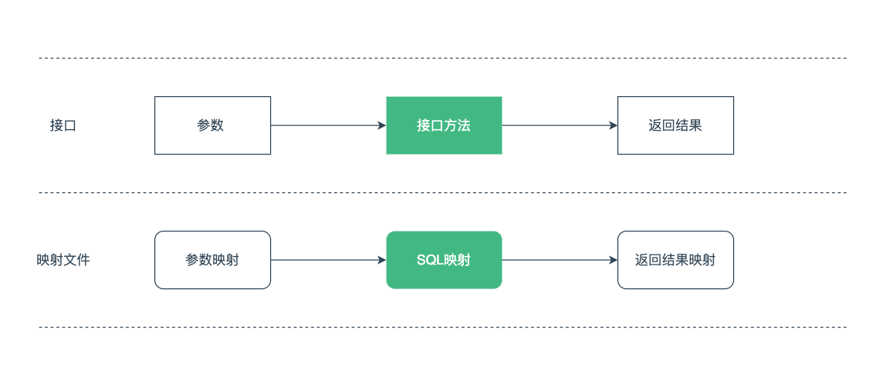

[TOC]

MyBatis 是一款优秀的持久层框架，它的强大之处正是 SQL 语句映射，这一章介绍常用的增删改查操作。

详细配置参阅《[MyBatis介绍与配置](https://mp.weixin.qq.com/s/pcCrXLC47GoHmGUM52dLpQ)》

## 一、 概述    

Java 数据持久层实现了应用程序与数据源的交互，应用程序通常使用分层架构，进行应用与数据间的解耦。

数据持久层主要负责数据的增、删、改、查等功能，MyBatis 则是一款优秀的持久层框架。

## 二、映射

MyBatis 的强大之处正是它的语句映射，简单地使用 XML 配置将数据访问接口与 SQL 语句进行绑定。

而且对接口的参数与返回值也能很好地进行映射。



### 1. 查询

查询语句是最常用的语句之一，例如下面的用户查询接口。

```java
public interface UserMapper {

    User selectById(Long id);

    List<User> selectList();
}
```

上面示例接口对应的 XML 映射如下，参数通过 `#{}` 占位符来指定。

返回结果映射可以使用 `resultType` 和 `resultMap` 来指定。

```xml
<mapper namespace="cn.codeartist.mybatis.mapper.UserMapper">

    <resultMap id="resultMap" type="cn.codeartist.mybatis.entity.User">
        <id property="id" column="id"/>
        <result property="name" column="name"/>
        <result property="username" column="username"/>
        <result property="password" column="password"/>
        <result property="createTime" column="create_time"/>
        <result property="updateTime" column="update_time"/>
    </resultMap>

    <select id="selectById" resultType="cn.codeartist.mybatis.entity.User">
        SELECT * FROM t_user WHERE id = #{id}
    </select>

    <select id="selectList" resultMap="resultMap">
        SELECT * FROM t_user
    </select>

</mapper>
```

### 2. 新增、更新、删除

MyBatis 中的 DML 语句实现也很简单，`insert, update, delete` 实现都类似。

```java
public interface UserMapper {

    void insert(User user);

    void updateById(User user);

    void deleteById(Long id);
}
```

上面示例接口对应的 XML 映射如下，参数的映射和查询语句一致。

```xml
<mapper namespace="cn.codeartist.mybatis.mapper.UserMapper">

    <insert id="insert">
        INSERT INTO t_user (name,username,password) VALUES (#{name},#{username},#{password})
    </insert>

    <update id="updateById">
        UPDATE t_user SET username = #{username},password = #{password} WHERE id = #{id}
    </update>

    <delete id="deleteById">
        DELETE FROM t_user WHERE id = #{id}
    </delete>
</mapper>
```

### 3. SQL片段

MyBatis 支持使用 `<sql>` 来定义可重用的 SQL 片段，它可以在其他 SQL 语句中使用。

```xml
<mapper namespace="cn.codeartist.mybatis.mapper.UserMapper">

    <sql id="base_columns">
        id,name,username,password
    </sql>

    <select id="selectById" resultType="cn.codeartist.mybatis.entity.User">
        SELECT <include refid="base_columns"/> FROM t_user WHERE id = #{id}
    </select>
</mapper>
```

### 4. 参数

前面的语句都使用了简单的参数形式，大多数场景下只需使用这种形式。

```xml
<select id="selectById" resultType="User">
    SELECT * FROM t_user WHERE id = #{id}
</select>
```

对于原始类型或简单数据类型（`int, long, Integer, String` 等），直接使用值作为参数。

如果参数是一个复杂的对象，配置如下：

```xml
<insert id="insert" parameterType="User">
    INSERT INTO t_user (name,username,password) VALUES (#{name},#{username},#{password})
</insert>
```

也可以在参数占位符中手动指定特殊的数据类型。

`javaType` 大多数情况可以根据对象类型判断，除非该对象是一个 `HashMap`。

如果列允许使用 `null` 值，则需要指定 `jdbcType`。

```
#{age,javaType=int,jdbcType=NUMERIC}
```

如果需要使用自定义类型处理方式，可以指定一个特殊的类型处理器类（或别名）。

```
#{age,javaType=int,jdbcType=NUMERIC,typeHandler=MyTypeHandler}
```

**字符串替换**

默认情况下，使用 `#{}` 参数语法时，MyBatis 会创建 `PreparedStatement` 参数占位符，并通过占位符安全地设置参数（就像使用 `?` 一样）。

如果需要直接在 SQL 语句中直接插入一个不转义的字符串。 比如 `ORDER BY` 子句，可以使用 `${}` 来拼接。

```sql
ORDER BY ${columnName}
```

> 用这种参数方式接受用户输入，会导致 SQL 注入攻击，因此，要么禁止用户输入这些字段，要么自行转义并检验这些参数。

## 三、附录

### 1. 示例代码

Gitee 仓库：

<https://gitee.com/code_artist/mybatis>

### 2. 参考文献

MyBatis 3 官方文档：

<https://mybatis.org/mybatis-3/zh/>
