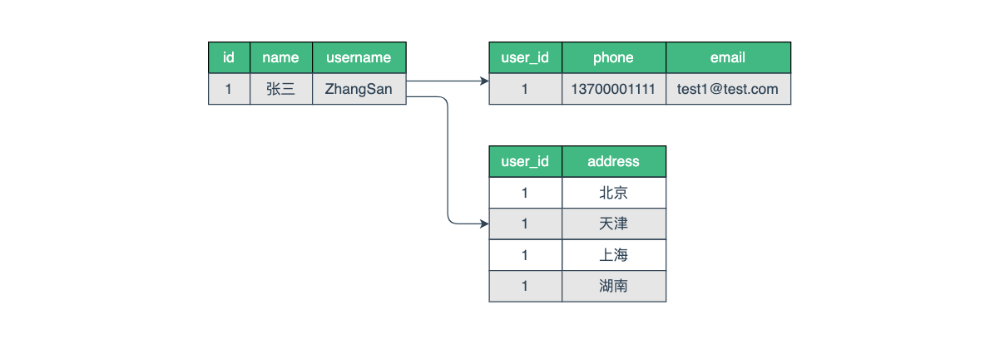

[TOC]

MyBatis 是一款优秀的持久层框架，它的强大之处正是 SQL 语句映射，这一章介绍常用的结果映射。

详细配置参阅《[MyBatis介绍与配置](https://mp.weixin.qq.com/s/pcCrXLC47GoHmGUM52dLpQ)》

增删改查参阅《[MyBatis实践之增删改查](https://mp.weixin.qq.com/s/rfKcEaNa8A-FxOIDNTvYjA)》

## 一、 概述

Java 数据持久层实现了应用程序与数据源的交互，大多数时候需要使用到各种查询语句。

MyBatis 支持对各种单表查询、关联查询等各种复杂查询的结果进行映射。

## 二、结果映射

`resultMap` 元素是 MyBatis 中最重要最强大的元素，大部分查询语句返回的结果，都能通过简单的配置来返回映射的 Java 对象。

假设存在这样一个实体模型，一个用户对应有一个基本信息和扩展信息，对应有多个地址。

简单讲，用户基本信息与用户扩展信息是一对一的关系，与用户地址是一对多的关系。




创建实体类和数据访问接口如下：

```java
// 用户基本信息实体
@Data
public class User {

    private Long id;
    private String name;
    private String username;
    private String password;
    private Integer status;

    private UserExt extend;
    private List<Address> addresses;
}

// 用户扩展信息实体
@Data
public class UserExt {

    private Long id;
    private Long userId;
    private String phone;
    private String email;
}

// 用户地址信息实体
@Data
public class Address {

    private Long id;
    private Long userId;
    private String address;
}

// 用户相关接口
public interface UserExtMapper {

    // 查询用户基本信息
    User selectById(Long id);

    // 查询用户基本信息和扩展信息（一对一）
    User selectExt(Long id);

    // 查询用户基本信息和地址信息（一对多）
    User selectAddresses(Long id);
}
```

### 1. 基本映射

基本映射是对查询返回的结果映射成一个最简单的 JavaBean 类，通过类属性对应数据库字段进行映射。

`<id>` 和 `<result>` 元素都将列映射到一个简单的数据类型（`String, int, double` 等）的属性或字段。

其中的 `property` 对应 Java 类 属性名称，`column` 对应数据库列名称。

```xml
<mapper namespace="cn.codeartist.mybatis.mapper.UserExtMapper">

    <resultMap id="baseMap" type="User">
        <id property="id" column="id"/>
        <result property="name" column="name"/>
        <result property="username" column="username"/>
        <result property="password" column="password"/>
        <result property="status" column="status"/>
    </resultMap>

    <select id="selectById" resultMap="baseMap">
        SELECT * FROM t_user WHERE id = #{id}
    </select>

</mapper>
```

### 2. 关联映射

关联映射是对查询返回的结果映射成一对一关系的嵌套类，例如查询同时返回用户基本信息和用户扩展信息。

使用 `<association>` 元素来指定关联映射，它可以映射一个关联查询语句的结果，也可以映射两个查询语句结合返回复杂的类型。

其中的 `property` 对应主表类型的属性，`column` 对应主表关联字段，`javaType` 对应关联表类型，`select` 对应另一个查询语句。

如果映射一个关联语句的结果，则不会使用 `select` 属性。

```xml
<mapper namespace="cn.codeartist.mybatis.mapper.UserExtMapper">

    <resultMap id="associationMap" type="User">
        <id property="id" column="id"/>
        <result property="name" column="name"/>
        <result property="username" column="username"/>
        <result property="password" column="password"/>
        <result property="status" column="status"/>
        <association property="extend" column="id" javaType="UserExt" select="selectUserExtById">
            <id property="id" column="id"/>
            <result property="userId" column="user_id"/>
            <result property="phone" column="phone"/>
            <result property="email" column="email"/>
        </association>
    </resultMap>

    <select id="selectExt" resultMap="associationMap">
        SELECT * FROM t_user WHERE id = #{id}
    </select>

    <select id="selectUserExtById" resultType="UserExt">
        SELECT * FROM t_user_ext WHERE user_id = #{id}
    </select>

</mapper>
```

### 3. 集合映射

集合映射是对查询返回的结果映射成一对多关系的嵌套类，例如查询同时返回用户信息和用户的地址信息。

使用 `<collection>` 元素来指定集合映射，它可以映射一个关联查询语句的结果，也可以映射两个查询语句结合返回复杂的类型。

它的用法与关联查询 `<association>` 类似，只不过指定关联表类型需要使用 `ofType` 属性，为了区分集合存储的类型。

```xml
<mapper namespace="cn.codeartist.mybatis.mapper.UserExtMapper">

    <resultMap id="collectionMap" type="User">
        <id property="id" column="id"/>
        <result property="name" column="name"/>
        <result property="username" column="username"/>
        <result property="password" column="password"/>
        <result property="status" column="status"/>
        <collection property="addresses" column="id" ofType="Address" select="selectAddressById">
            <id property="id" column="id"/>
            <result property="userId" column="user_id"/>
            <result property="address" column="address"/>
        </collection>
    </resultMap>

    <select id="selectAddresses" resultMap="collectionMap">
        SELECT * FROM t_user WHERE id = #{id}
    </select>

    <select id="selectAddressById" resultType="Address">
        SELECT * FROM t_address WHERE user_id = #{id}
    </select>

</mapper>
```

同时指定集合类型和 Java 类型：

```xml
<collection property="addresses" javaType="ArrayList" column="id" ofType="Address" select="selectAddressById"/>
```

### 4. 自动映射

MyBatis 支持在简单的场景下，可以自动映射结果，在复杂的场景下，只需描述语句之间的关系就行。

当配置自动映射结果时，数据库列名与 Java 类属性名称会忽略大小写映射，例如 `ID` 列会和 `id` 属性进行映射。

通常数据库列名使用下划线规范，而 Java 属性遵循驼峰命名，将  `mapUnderscoreToCamelCase` 设置为 `true` 时，会启用自动映射。

例如前面的基本映射、关联映射和集合映射可以简化成下面配置：

```xml
<mapper namespace="cn.codeartist.mybatis.mapper.UserExtMapper">

    <resultMap id="associationMap" type="User">
        <association property="extend" column="id" javaType="UserExt" select="selectUserExtById"/>
    </resultMap>

    <resultMap id="collectionMap" type="User">
        <collection property="addresses" column="id" ofType="Address" select="selectAddressById"/>
    </resultMap>

    <select id="selectById" resultType="User">
        SELECT * FROM t_user WHERE id = #{id}
    </select>

    <select id="selectExt" resultMap="associationMap">
        SELECT * FROM t_user WHERE id = #{id}
    </select>

    <select id="selectUserExtById" resultType="UserExt">
        SELECT * FROM t_user_ext WHERE user_id = #{id}
    </select>

    <select id="selectAddresses" resultMap="collectionMap">
        SELECT * FROM t_user WHERE id = #{id}
    </select>

    <select id="selectAddressById" resultType="Address">
        SELECT * FROM t_address WHERE user_id = #{id}
    </select>

</mapper>
```

## 三、附录

### 1. 示例代码

Gitee 仓库：

<https://gitee.com/code_artist/mybatis>

### 2. 参考文献

MyBatis 3 官方文档：

<https://mybatis.org/mybatis-3/zh/>