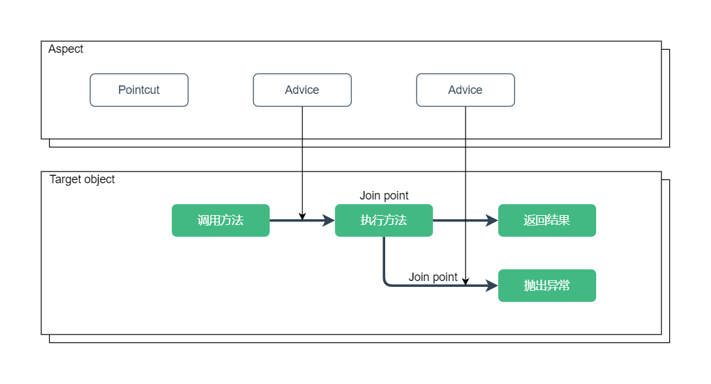
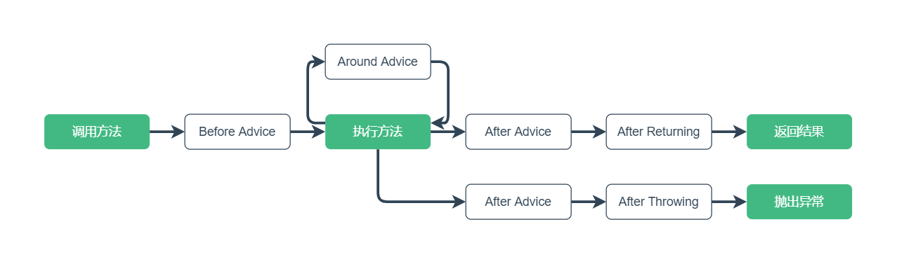
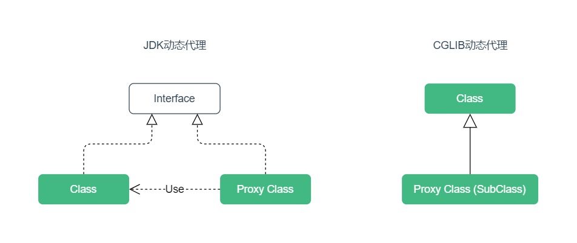

[TOC]

Spring 除 IoC 容器外的另一个核心功能是 AOP，面向切面编程是对编程结构的另一种思考。

## 一、概述

AOP 提供一种通用的扩展机制，在业务操作前后提供一些切面的操作，这些操作通常是和业务无关的，例如：日志记录、性能统计、安全控制、事务处理、异常处理等。

### 1. AOP 术语

AOP（Aspect Oriented Programming）面向切面编程的概念比较抽象，主要涉及下面这些术语：

- **Aspect（切面）**：切入一个或多个类的模块
- **Join point（连接点）**：程序执行的节点，例如执行方法或处理异常
- **Advice（通知）**：切面在连接点执行的动作，例如前置通知
- **Pointcut（切点）**：用于匹配连接点，一般通过表达式匹配
- **Target object（目标对象）**：被切入的对象，可以被一个或多个切面切入

使用 AOP 时，需要定义实现切面的类，在切面中指定切点和通知。



一个目标类可以被多个切面切入，多个切面也可以切入一个目标类。

切面实现的本质是一个或多个基于连接点的拦截器。

### 2. 通知类型

Spring AOP 提供了下面五种通知类型：

- **Before advice（前置通知）**：连接点前面执行，不能终止后续流程，除非抛异常
- **After returning advice（后置通知）**：连接点正常返回时执行，有异常不执行
- **Around advice（环绕通知）**：围绕连接点前后执行，也能捕获处理异常
- **After advice（最终通知）**：连接点退出时执行，无论是正常退出还是异常退出
- **After throwing advice（异常通知）**：连接点方法抛出异常时执行

AOP 的连接点一般是指目标类的方法，五种通知类型执行的节点如下：



## 二、动态代理

Spring AOP 底层是基于动态代理实现的，对实现接口的类进行代理，默认使用 JDK 动态代理，对没实现接口的类，使用 CGLIB 动态代理。



### 1. JDK 动态代理

JDK 动态代理通过实现接口生成代理类，使用拦截器加反射机制生成。

```java
public static void main(String[] args) {

    // JDK Proxy
    DemoService demoService = new DemoServiceImpl();
    DemoServiceProxy proxy = new DemoServiceProxy();
    DemoService proxyTarget = (DemoService) proxy.getTarget(demoService);
    proxyTarget.doService();
}
```

### 2. CGLIB 动态代理

CGLIB 动态代理通过继承生成代理子类，使用字节码技术生成。

通过子类对父类的方法进行重写来实现代理，因此，对 `final` 修饰的方法不能代理。

```java
public static void main(String[] args) {

    // CGLib Proxy
    Enhancer enhancer = new Enhancer();
    enhancer.setSuperclass(DemoServiceImpl.class);
    enhancer.setCallback(new DemoServiceInterceptor());
    DemoService service = (DemoService) enhancer.create();
    service.doService();
}
```

**强制使用 CGLIB 代理**

Spring AOP 中的目标类不管有没有实现接口，都可以通过配置来强制使用 CGLIB 代理方式。

基于 XML 配置：

```xml
<aop:config proxy-target-class="true">
    <!-- other beans defined here... -->
</aop:config>

<!-- 或者 -->
<aop:aspectj-autoproxy proxy-target-class="true"/>
```

基于注解配置：

```java
@EnableAspectJAutoProxy(proxyTargetClass = true)
```

## 三、附录

### 1. 示例代码

Gitee 仓库：

https://gitee.com/code_artist/spring

项目模块：

`spring-aop`

示例路径：

`cn.codeartist.spring.aop.proxy`

