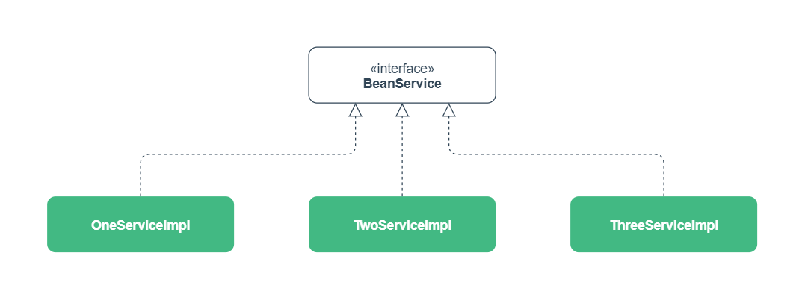

# 第6章 同类型多个Bean的注入

Spring 容器中的 Bean 之间会有很多依赖关系，在注入依赖的时候，容器需要明确知道注入的是哪一个 Bean。

## 一、类型注入冲突

Spring 容器中的 Bean 依赖可以通过名称注入，或者类型注入。

**通过名称注入**

名称注入会指定一个明确的 Bean 名称，容器不允许注册相同名称的 Bean，所以不会有任何问题。

**通过类型注入**

通过类型注入的时候，有时会因为多个 Bean 的类型相同而产生冲突。例如：

- 同一类型注册多个不同名称的 Bean
- 抽象类型注册多个不同实现类的 Bean

这种情况下，容器不知道该注入哪个会抛出 `NoUniqueBeanDefinitionException` 异常。

## 二、解决冲突

假设在项目中定义一个 `BeanService` 接口，基于该接口有三个实现类 `OneServiceImpl`、`TwoServiceImpl` 和 `ThreeServiceImpl`，三个实现类都由 Spring 容器管理。



在项目中通过 `BeanService` 接口的类型注入，会产生冲突抛出异常。

```java
// BeanService的三个实现类注册Bean
@Configuration
public class AppConfig {

    @Bean
    public BeanService oneServiceImpl() {
        return new OneServiceImpl();
    }

    @Bean
    public BeanService twoServiceImpl() {
        return new TwoServiceImpl();
    }

    @Bean
    public BeanService threeServiceImpl() {
        return new ThreeServiceImpl();
    }
}

// 通过接口的类型注入会抛出异常
public class ServiceTest {
    
    @Autowired
    private BeanService beanService;
}
```

### 1. 注入主要的

注册 Bean 的时候，使用 `@Primary` 指定一个 Bean 为主要的，存在冲突时默认选择主要的 Bean。

```java
@Configuration
public class AppConfig {

    @Bean
    @Primary
    public BeanService oneServiceImpl() {
        return new OneServiceImpl();
    }
    
    // ......
}
```

`@Primary` 注解也可和 `@Component` 等注解一起使用。

### 2. 注入指定的

注入 Bean 的时候，使用 `@Qualifier` 指定具体 Bean 的名称，通过名称注入解决冲突。

```java
public class ServiceTest {

    @Autowired
    @Qualifier("oneServiceImpl")
    private BeanService beanService;
    
    // ......
}
```

也可以直接通过**字段名称**来指定具体 Bean 的名称，来解决冲突。

```java
public class ServiceTest {

    @Autowired
    private BeanService oneServiceImpl;
    
    // ......
}
```

上面两种方法同样适用于构造器注入和 Setter 方法注入。

## 三、注入多个 Bean

在实际应用中，如果需要注入符合类型的所有 Bean，可以使用集合类型来注入。

集合类型的注入同样适用于字段注入、构造器注入和 Setter 方法注入。

### 1. 注入集合

通过数组来注入一种类型的所有 Bean。

```java
public class ServiceTest {

    @Autowired
    private BeanService[] beanServiceArr;
    
    // ......
}
```

通过 `List` 来注入一种类型的所有 Bean。

```java
public class ServiceTest {

    @Autowired
    private List<BeanService> beanServiceList;
    
    // ......
}
```

通过 `Set` 来注入一种类型的所有 Bean。

```java
public class ServiceTest {

    @Autowired
    private Set<BeanService> beanServiceSet;
    
    // ......
}
```

### 2. 注入 Map

通过 `Map` 来注入一种类型的所有 Bean，Key 的类型固定为 `String`。

Key 存储 Bean 的名称，Value 存储 Bean 的实例。

```java
public class ServiceTest {

    @Autowired
    private Map<String, BeanService> beanServiceMap;

    // ......
}
```

### 3. Bean 的顺序

注册 Bean 的时候可以使用 `@Order` 注解来指定 Bean 的权重（或顺序）。

在使用有序集合（数组或 `List`）注入的时候，会根据权重来排序。

```java
@Configuration
public class AppConfig {

    @Bean
    @Order(1)
    public BeanService oneServiceImpl() {
        return new OneServiceImpl();
    }

    @Bean
    @Order(3)
    public BeanService twoServiceImpl() {
        return new TwoServiceImpl();
    }

    @Bean
    @Order(2)
    public BeanService threeServiceImpl() {
        return new ThreeServiceImpl();
    }
}
```

上面配置类注册的 Bean 使用数组或 `List` 注入时，注入集合类型的元素顺序为：

```java
0 = {OneServiceImpl@1522} 
1 = {ThreeServiceImpl@1527} 
2 = {TwoServiceImpl@1528} 
```

`@Order` 注解也可和 `@Component` 等注解一起使用。

## 四、附录

### 1. 常用注解

| 注解         | 描述                                                       |
| :----------- | :--------------------------------------------------------- |
| `@Primary`   | 指定主要的 Bean，存在注入冲突时默认注入的 Bean             |
| `@Qualifier` | 指定注入 Bean 的名称                                       |
| `@Order`     | 指定注册同类型的 Bean 的权重（或顺序），值越小，权重越大。 |

### 2. 示例代码

Gitee 仓库：

https://gitee.com/code_artist/spring

项目模块：

`spring-ioc`

示例路径：

`cn.codeartist.spring.bean.multi`

