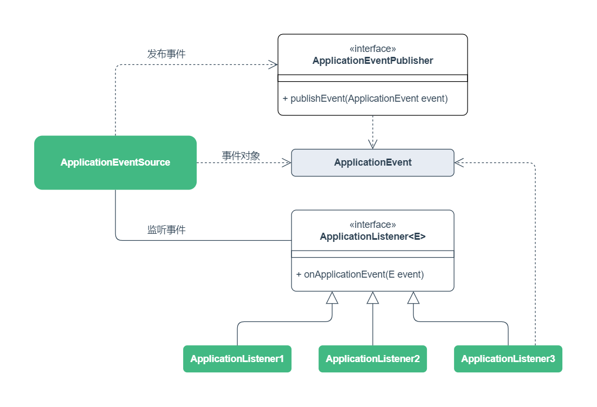

# 第9章 事件机制

Spring 容器提供了事件管理机制，Spring 容器内部很多节点都会发布事件，也支持自定义事件。

## 一、事件机制

事件机制是基于监听者设计模式的实现，监听者模式包括三个部分：

- **事件源**：具体事件源，用于发布事件
- **事件对象**：封装事件源对象和事件相关信息，用于在事件源和监听器之间传递信息
- **事件监听器**：监听事件，用于对事件进行处理

Spring 提供了 `ApplicationEventPublisher` 接口用于发布事件。

可以通过继承 `ApplicationEvent` 抽象类来定义事件对象。

可以通过实现 `ApplicationListener<E>` 接口来定义事件监听器。



### 1. 发布事件

在项目中，先定义一个事件对象来封装事件传递的相关信息。

事件源实现 `ApplicationEventPublisherAware` 接口注入事件发布者。

使用 `ApplicationEventPublisher` 事件发布者发布事件。

```java
// 事件对象
public class CustomEvent extends ApplicationEvent {

    private final String name;

    public CustomEvent(Object source, String name) {
        super(source);
        this.name = name;
    }

    public String getName() {
        return name;
    }
}

// 事件源
@Component
public class CustomService implements ApplicationEventPublisherAware {

    private ApplicationEventPublisher publisher;

    public void test() {
        CustomEvent event = new CustomEvent(this, "CodeArtist");
        publisher.publishEvent(event);
    }

    @Override
    public void setApplicationEventPublisher(ApplicationEventPublisher applicationEventPublisher) {
        this.publisher = applicationEventPublisher;
    }
}
```

### 2. 监听事件

通过实现 `ApplicationListener<E>` 接口定义一个监听器类，接口泛型指定事件对象。

泛型指定的事件对象决定了该监听器监听的事件。

```java
@Component
public class CustomEventListener implements ApplicationListener<CustomEvent> {

    @Override
    public void onApplicationEvent(CustomEvent event) {
        // Do something
    }
}
```

除了监听自定义事件外，也可以监听 Spring 内部发布的事件：

- `ApplicationStartedEvent`
- `ApplicationReadyEvent`
- `ApplicationFailedEvent`
- `ApplicationStartingEvent`

可以查看 `ApplicationEvent` 抽象类的子类来了解 Spring 提供了哪些事件。

### 3. 基于注解监听

在 Bean 类的方法上使用 `@EventListener` 注解可以更简单的监听事件。

通过方法参数上的事件对象来指定监听的事件。

也可以通过注解的 `value/classes` 属性来指定监听的事件对象。

```java
@Component
public class CustomNotifier {

    @EventListener
    public void listener(CustomEvent event) {
        System.out.println("Annotation listener: " + event.getName());
    }

    @EventListener(CustomEvent.class)
    public void listener() {
        System.out.println("Annotation listener.");
    }
}
```

## 二、顺序监听

每个事件都可以定义多个监听器，默认情况下监听器执行的顺序是未知的。

可以使用 `@Order` 注解来指定监听器的权重，来确定监听器的执行顺序。

```java
@Component
public class CustomNotifier {

    @Order(1)
    @EventListener
    public void listener1(CustomEvent event) {
        System.out.println("Order 1: " + event.getName());
    }

    @Order(2)
    @EventListener
    public void listener2(CustomEvent event) {
        System.out.println("Order 2: " + event.getName());
    }

    @Order(3)
    @EventListener
    public void listener3(CustomEvent event) {
        System.out.println("Order 3: " + event.getName());
    }
}
```

## 三、异步监听

默认监听器都是同步处理事件任务的，可以使用 `@Async` 注解来进行异步处理。

```java
@Component
@EnableAsync
public class CustomNotifier {

    @Async
    @EventListener
    public void listenerAsync(CustomEvent event) {
        System.out.println("Async: " + event.getName());
    }
}
```

> 使用 `@Async` 注解需要 `@EnableAsync` 来启用 Spring 的异步功能。

## 四、附录

### 1. 常用注解

| 注解             | 描述                       |
| :--------------- | :------------------------- |
| `@EventListener` | 定义方法为监听事件的监听器 |
| `@Async`         | 指定异步执行方法           |
| `@EnableAsync`   | 启用异步执行功能           |

### 2. 示例代码

Gitee 仓库：https://gitee.com/code_artist/spring

项目模块：`spring-ioc`

示例路径：`cn.codeartist.spring.event`
