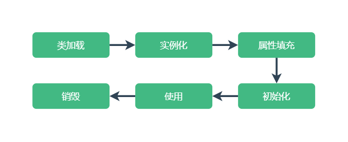
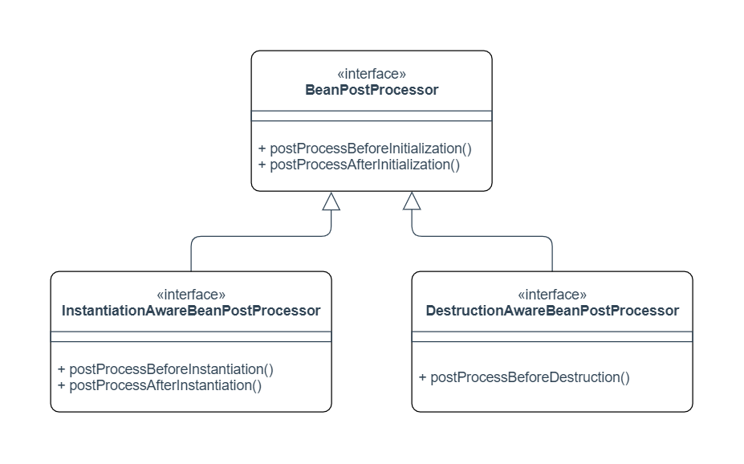
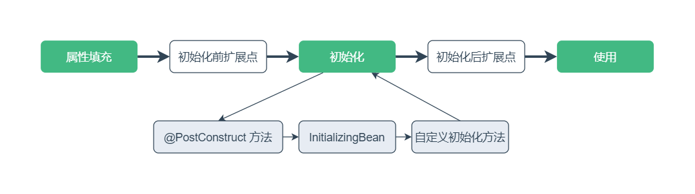
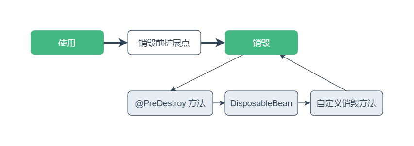
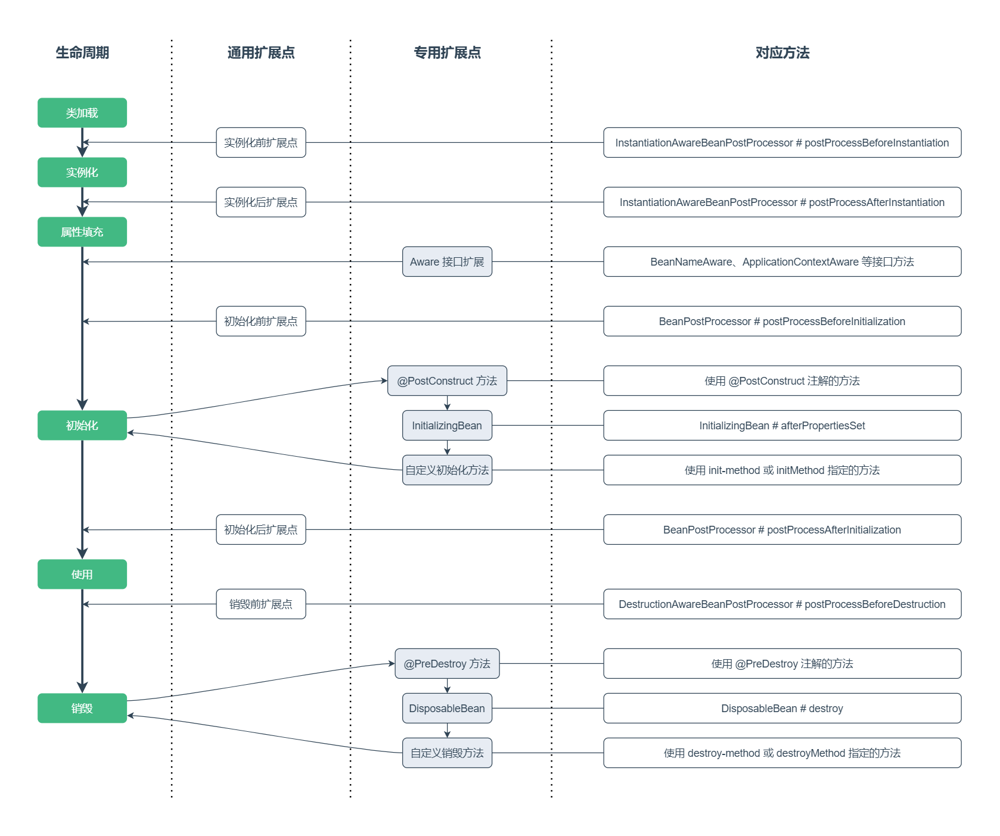

[TOC]

Spring 的核心是 IoC 容器，了解 Bean 的生命周期非常重要，这对 Spring 在项目中的应用和扩展都很有帮助。

## 一、生命周期

Bean 的生命周期主要为实例化、属性填充、初始化和销毁 4 个阶段，加上类加载和使用阶段，整个流程如下：



## 二、Bean 的扩展

Spring 在每个阶段都提供了扩展点，扩展点可以分为两类：

- 专用扩展点：用于单个 Bean 的扩展，定义 Bean 类时实现接口来扩展功能。
- 通用扩展点：用于所有 Bean 的扩展，单独定义类实现接口来扩展功能。

### 1. 专用扩展点

**`Aware` 接口**

`Aware` 接口可以在属性填充的时候注入 Bean 信息或上下文等信息。

例如可以通过实现 `BeanNameAware` 接口将当前 Bean 的名称注入到类中。

```java
public class OneBeanExample implements BeanNameAware {

    private String beanName;

    @Override
    public void setBeanName(String name) {
        this.beanName = name;
    }
}
```

Spring 提供了许多 `Aware` 的子接口可以使用，常用的有：

| Aware接口                        | 注入依赖                                           |
| :------------------------------- | :------------------------------------------------- |
| `BeanNameAware`                  | Bean 的名称                                        |
| `BeanFactoryAware`               | 当前上下文的 `BeanFactory`                         |
| `ApplicationContextAware`        | 当前上下文的 `ApplicationContext`                  |
| `ApplicationEventPublisherAware` | 当前上下文的事件发布者 `ApplicationEventPublisher` |
| `BeanClassLoaderAware`           | 加载 Bean 类的类加载器                             |

**`InitializingBean` 和 `DisposableBean` 接口**

如果要在 Bean 初始化时添加自定义逻辑，可以实现 `InitializingBean` 接口。

如果要在 Bean 销毁时添加自定义逻辑，可以实现 `DisposableBean` 接口。

```java
public class OneBeanExample implements InitializingBean, DisposableBean {

    @Override
    public void afterPropertiesSet() {
		// do some initialization work
    }

    @Override
    public void destroy() {
		// do some destruction work
    }
}
```

除了上面两个回调接口，也可以在注册 Bean 的时候指定自定义初始化和销毁方法。

`@Bean` 注解的 `initMethod` 属性指定 Bean 初始化方法，`destroyMethod` 属性指定 Bean 销毁方法。

```java
public class OneBeanExample {

    public void init() {
        // do some initialization work
    }

    public void destroy() {
        // do some destruction work
    }
}

@Configuration
public class AppConfig {

    @Bean(initMethod = "init", destroyMethod = "destroy")
    public OneBeanExample oneBeanExample() {
        return new OneBeanExample();
    }
}
```

对应 XML 配置 `<bean>` 标签的 `init-method` 和 `destroy-method` 属性。

还可以使用 JDK 的 `@PostConstruct` 和 `@PreDestroy` 注解来指定初始化方法和销毁方法。

```java
public class OneBeanExample {

    @PostConstruct
    public void init() {
        // do some initialization work
    }

    @PreDestroy
    public void destroy() {
        // do some destruction work
    }
}
```

前面提供的三种方式都可以定义 Bean 初始化和销毁时执行的方法。

> `InitializingBean` 和 `DisposableBean` 接口会和 Spring 强耦合。
>
> 当项目中没有依赖 Spring 时，推荐使用第二种或第三种方式。

### 2. 通用扩展点

通用扩展点对所有 Bean 有效，需要定义单独的类来实现，主要有三个接口：

- `BeanPostProcessor` 接口
- `InstantiationAwareBeanPostProcessor` 接口
- `DestructionAwareBeanPostProcessor` 接口



**`BeanPostProcessor` 接口**

实现该接口可以在 Bean 初始化前后添加自定义逻辑。

```java
@Component
public class BeanInitProcessor implements BeanPostProcessor {

    @Override
    public Object postProcessBeforeInitialization(Object bean, String beanName) throws BeansException {
        // before initialization work
        return bean;
    }

    @Override
    public Object postProcessAfterInitialization(Object bean, String beanName) throws BeansException {
        // after initialization work
        return bean;
    }
}
```

**`InstantiationAwareBeanPostProcessor` 接口**

实现该接口可以在 Bean 实例化前后添加自定义逻辑。

```java
@Component
public class BeanInstanceProcessor implements InstantiationAwareBeanPostProcessor {

    @Override
    public Object postProcessBeforeInstantiation(Class<?> beanClass, String beanName) throws BeansException {
        // before instantiation work
        return null;
    }

    @Override
    public boolean postProcessAfterInstantiation(Object bean, String beanName) throws BeansException {
        // after instantiation work
        return true;
    }
}
```

**`DestructionAwareBeanPostProcessor` 接口**

实现该接口可以在 Bean 销毁前添加自定义逻辑。

```java
@Component
public class BeanDestroyProcessor implements DestructionAwareBeanPostProcessor {

    @Override
    public void postProcessBeforeDestruction(Object bean, String beanName) throws BeansException {
        // before destruction work
    }
}
```

### 3. 生命周期扩展点示例

Bean 生命周期的 4 个阶段都支持扩展，每个阶段都可以添加自定义逻辑。

#### 3.1 实例化

Spring 容器在这步实例化 Bean 对象。

实现 `InstantiationAwareBeanPostProcessor` 接口的两个扩展方法，在实例化前后添加扩展。


#### 3.2 属性填充

Spring 容器在这步填充属性，例如通过 Setter 方法注入依赖。

属性填充后通过 `Aware` 接口扩展来注入 Bean 信息或上下文等信息。


#### 3.2 初始化

Spring 容器在这步初始化 Bean。

实现 `BeanPostProcessor` 接口的两个扩展方法，在初始化前后添加扩展。



在初始化阶段，前面讲到三种方式来指定初始化方法，一般情况下使用一种就行。

如果同时使用三种，三种方式指定的方法相同，该方法只执行一次，当三种方式指定的方法不同，按图中顺序执行。

#### 3.4 销毁

Spring 容器在这步销毁 Bean，可以释放外部资源。

实现 `DestructionAwareBeanPostProcessor` 接口的扩展方法，可以在销毁前添加扩展。



在销毁阶段，前面讲到三种方式来指定销毁方法，一般情况下使用一种就行。

如果同时使用三种，三种方式指定的方法相同，该方法只执行一次，当三种方式指定的方法不同，按图中顺序执行。

### 4. 生命周期扩展点顺序

Bean 的生命周期中，通用扩展点和专用扩展点，以及它们对应的方法，执行顺序如下图：



## 三、附录

### 1. 配置属性

| 属性                           | 描述                                      |
| :----------------------------- | :---------------------------------------- |
| `<bean>`的`init-method`属性    | 基于 XML 配置容器中，指定自定义初始化方法 |
| `<bean>`的`destroy-method`属性 | 基于 XML 配置容器中，指定自定义销毁方法   |

### 2. 常用注解

| 注解                         | 描述                                       |
| :--------------------------- | :----------------------------------------- |
| `@Bean`的`initMethod`属性    | 基于 Java 配置容器中，指定自定义初始化方法 |
| `@Bean`的`destroyMethod`属性 | 基于 Java 配置容器中，指定自定义销毁方法   |
| `@PostConstruct`             | 使用 JDK 注解指定初始化执行的方法          |
| `@PreDestroy`                | 使用 JDK 注解指定销毁执行的方法            |

### 3. 示例代码

Gitee 仓库：

https://gitee.com/code_artist/spring

项目模块：

`spring-ioc`

示例路径：

`cn.codeartist.spring.bean.life`

